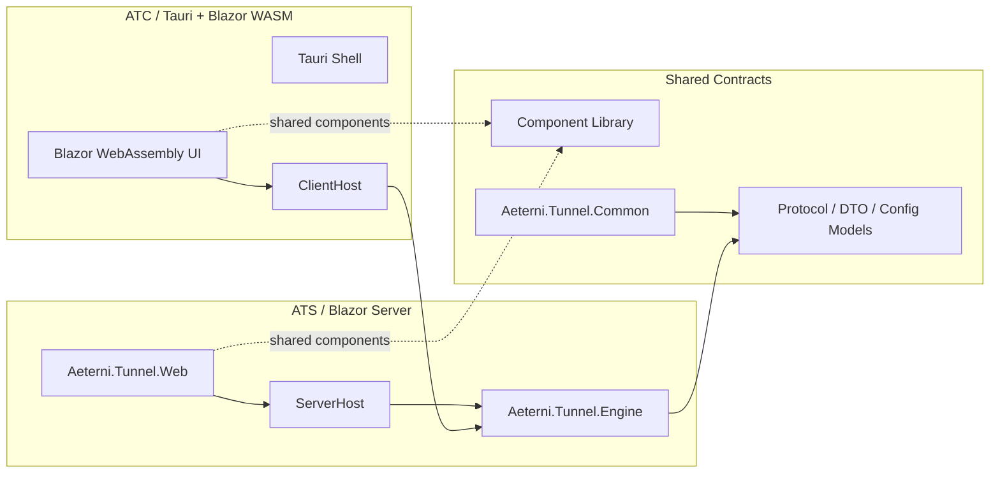

# Aeterni Tunnel 重构计划

## 1. 目标

在保持已有 ATS/ATC/Engine 架构稳定的前提下，将项目拆分为更清晰的职责边界：

- 服务端继续保留为 Blazor Server 管理台，作为集中控制面和运维入口。
- 客户端切换为 Tauri + Blazor WebAssembly 模式，负责本地托管、健康检查、隧道状态展示和用户交互。
- 引擎层保持稳定，作为跨平台核心能力的唯一真实实现，不做大规模重写。
- 组件库项目负责统一 UI 设计系统，服务端和客户端共用同一套组件、样式和交互规范。
- 在不破坏现有协议与部署方式的前提下，预留 P2P、设备直连和更低延迟链路的扩展空间。

## 2. 设计原则

1. Engine 维持“核心与协议”不可随意替换。
2. UI 层与业务层解耦，避免 Web、Desktop、Tauri 互相耦合。
3. 共享协议、配置模型和 DTO 明确落到公共项目中。
4. 渐进式切换：先抽离共享层，再迁移客户端，再统一组件库。
5. 保持跨平台兼容，避免依赖特定 OS 或浏览器能力。
6. P2P 能力作为增强能力实现，不打破现有 ATS/ATC 模式。

## 3. 目标架构



### 3.1 服务端：Blazor Server 保持不变

- 继续承载管理台、登录、配置、日志和隧道状态展示。
- 继续使用 `Aeterni.Tunnel.Web` 作为 UI 与 ATS 的宿主入口。
- 仅对边界进行整理：
  - 将 UI 逻辑与后台服务逻辑分离。
  - 将可复用的 DTO、配置项、协议模型抽离到共享层。
  - 将大量页面状态与交互逻辑提炼成 ViewModel / Service 层。

### 3.2 客户端：Tauri + Blazor WASM

- 新增 Tauri Shell 作为原生桌面进程入口。
- Blazor WASM 负责页面渲染、表单、列表、状态视图和用户交互。
- Tauri 主要负责：
  - 本地设备能力调用
  - 文件读写与配置目录
  - 系统托盘、窗口管理、日志输出
  - 进程与桥接通信
- `Aeterni.Tunnel.Engine` 仍然作为底层能力层，不由 WASM 直接运行复杂系统服务；必要时通过 Tauri bridge 或本地 host 调度。

### 3.3 组件库：统一 UI 设计系统

- 组件库项目统一定义视觉规范、基础组件和交互模式。
- 所有项目按统一规则实现：
  - 颜色、间距、圆角、深浅主题
  - 表单、按钮、对话框、表格、状态卡片
  - 统一错误/成功/警告状态样式
- Server 与 Tauri Client 共用组件库，以保证一致性。

## 4. 重构分阶段

### Phase 0：基线与隔离

- 识别当前 `Aeterni.Tunnel.Web`、`Aeterni.Tunnel.Desktop`、`Aeterni.Tunnel.Engine` 的职责边界。
- 形成“共享层 / 业务层 / UI 层”清单。
- 明确哪些代码可以保留，哪些代码应搬迁到公共项目。
- 目标：确保当前功能在改造前可回归测试。

### Phase 1：抽离共享契约

- 建立共享库（例如 `Aeterni.Tunnel.Common`、`Aeterni.Tunnel.Contracts` 或设计系统基础项目）。
- 抽离：
  - `Protocol` 相关 DTO
  - `Config` 模型
  - `Tunnel` / `Client` / `Host` 公共视图模型
  - 日志、状态枚举和事件定义
- 作用：减少服务端和客户端重复定义、降低 UI 与 Engine 的耦合。

### Phase 2：服务端整理

- 保持 Blazor Server 不变，重点进行内部整理：
  - 抽离页面服务层（PageService / HubService / ConfigService）
  - 抽离状态管理与配置更新逻辑
  - 对管理端与 Engine 的适配层收敛到单一入口
- 目标：减少 UI 和宿主 API 混杂。

### Phase 3：客户端 Tauri 化

- 新增 Tauri 应用工程，保留 Blazor WASM 前端。
- 定义：
  - Tauri shell
  - Tauri 命令桥接层
  - 进程生命周期管理
  - 本地配置文件与日志目录
- 客户端 UI 通过 WASM 渲染，后台能力通过桥接调用本地宿主服务。

### Phase 4：组件库统一

- 引入组件库项目。
- 将 Web 管理台和 Tauri 前端统一切换到同一套组件定义。
- 统一统一主题、组件 API 和交互行为。
- 逐步将旧页面组件迁移到设计系统目录。

### Phase 5：P2P 能力扩展

- 保持现有 ATS/ATC 中继链路兼容，增加可选的 P2P 扩展层。
- P2P 采用“直连优先、ATS 中继回退”策略，不将直连成功作为运行前提。
- 第一阶段优先支持 UDP hole punching；TCP/HTTP 等可靠流量在后续基于可靠 UDP 或 QUIC 扩展。
- 详细实施计划见下方“P2P 分阶段实施计划（P1-P6）”。

### Phase 6：验证与回归

- 补充单元测试和端到端测试：
  - Engine 协议兼容
  - server config updates
  - tunneling reconnect behavior
  - Tauri bridge commands
  - UI component snapshots / interaction checks
- 执行 `dotnet test AeterniTunnel.slnx`
- 若改动 Web CSS/前端样式，执行 `npm run css:build`

### P2P 分阶段实施计划（P1-P6）

以下六个阶段是 Phase 5 的具体落地计划。每个阶段都应保持现有 ATS/ATC 中继功能可用，并以可独立验证、可回滚为交付边界。

#### P1：协议与数据模型

**目标**

- 在不破坏现有控制消息和数据帧的前提下，定义 P2P 会话、能力协商和链路状态模型。
- 明确客户端身份、会话绑定、候选地址和短期授权凭证的生命周期。

**主要工作**

- 新增可选 P2P 能力协商，例如 `PeerCapabilities`、`PeerTransport`、`PeerMode`。
- 新增协议消息：Peer 请求、Peer 接受/拒绝、候选地址交换、探测结果、链路切换和会话关闭。
- 为每次 P2P 会话生成唯一 `SessionId`、短期 `SessionToken` 和双方绑定信息。
- 设计协议版本与未知消息兼容规则；不支持 P2P 的旧客户端继续使用原有中继模式。
- 定义 `Direct`、`Relay`、`Hybrid` 三种策略，以及 `Pending`、`Probing`、`Direct`、`Relayed`、`Failed` 等状态。

**涉及模块**

- `Aeterni.Tunnel.Engine/Protocol`
- `Aeterni.Tunnel.Common` 或后续 `Aeterni.Tunnel.Contracts`
- `Aeterni.Tunnel.Engine.Tests` 的消息编解码与兼容性测试

**验收标准**

- 新旧客户端可以完成正常 Hello、隧道注册和 ATS 中继。
- 新消息可被旧客户端安全忽略或收到明确的“不支持”结果。
- Session Token 不能跨会话、跨 Peer 或重复使用。

#### P2：ATS 信令与 Peer 授权

**目标**

- 让 ATS 成为 Peer 发现、鉴权和候选地址交换中心，但不预先承担直连成功后的数据转发。

**主要工作**

- 增加在线 Agent/Peer 注册表，以及按 `ClientId` 查询在线会话的能力。
- 实现 Peer 连接请求、目标端同意/拒绝、候选地址转发和会话超时清理。
- 增加最小权限授权：请求方、目标方、隧道/服务标识和 Session Token 必须绑定。
- 为信令流程增加超时、取消、重复请求和客户端断线处理。
- 对不具备 P2P 能力或未同意 P2P 的任一端自动选择 ATS 中继。

**涉及模块**

- `Server/ServerListener.cs`
- `Server/ServerSession.cs`
- `Protocol/Messages`
- Web/管理端的 Peer 授权与状态展示适配层

**验收标准**

- 两个在线 Agent 可以通过 ATS 完成一次完整的请求、授权和候选地址交换。
- 未授权 Peer、过期 Token、目标离线和重复会话均被拒绝并记录原因。
- 信令失败不会影响既有隧道和重连流程。

#### P3：UDP hole punching 与直连建立

**目标**

- 在 Agent 之间建立经认证的 UDP 直连，优先承载 P2P UDP 隧道。

**主要工作**

- 为 Agent 增加长期复用的 UDP socket 和 Peer 数据报收发器。
- 通过 ATS 观测客户端对外映射端点；必要时支持本地候选地址和多个候选端点。
- 实现双方同步探测、nonce 校验、Session Token 校验、重放保护和握手超时。
- 增加 NAT 类型/探测结果记录；探测失败时明确转换到 Relay 状态。
- 将 Peer 数据报与现有 ATS Channel 数据面隔离，避免破坏当前帧协议。
- 第一阶段仅将 `LinkType.Udp` 纳入 P2P 直连范围；TCP/HTTP 不在本阶段强行复用 UDP。

**涉及模块**

- `Client`
- 新增 `Peer` 或 `P2P` 目录
- `Transport`
- `Protocol`
- `Aeterni.Tunnel.Engine.Tests`

**验收标准**

- 在可打洞的 NAT/网络环境下，双方能够建立双向认证的 UDP 直连。
- 未通过认证的探测包不进入业务数据面。
- 直连建立后，ATS 不再转发该会话的业务数据。
- 本地网络不支持打洞时，能在规定超时内返回失败原因并进入 P4。

#### P4：ATS 中继回退与链路策略

**目标**

- 确保 P2P 不可用时业务仍然可靠运行，并允许运行时在直连与中继之间切换。

**主要工作**

- 复用现有 `ChannelMultiplexer` 和 ATS 会话实现 Peer Relay。
- 实现 `Direct -> Relay` 的自动回退，以及必要的 `Relay -> Direct` 重试策略。
- 抽象统一的 Peer 数据通道接口，使业务隧道不感知底层链路。
- 对回退设置明确的超时、重试次数、最大会话时长和取消语义。
- 保持原有单 Agent 隧道完全不经过 P2P 逻辑，降低回归风险。

**涉及模块**

- `Channels`
- `Transport`
- `Server`
- `Client`
- P2P 策略/适配层

**验收标准**

- 直连失败后，业务在配置的超时时间内自动切换到 ATS 中继。
- 中继链路仍支持当前 TCP/UDP/HTTP/HTTPS 隧道能力。
- 链路切换不会泄露明文、重复投递数据或导致会话无限重试。
- Dashboard/TUI 能区分 `Direct`、`Relay`、`Probing` 和 `Offline`。

#### P5：可靠传输、配置、指标与运维

**目标**

- 在 UDP P2P MVP 稳定后，补齐可靠流量支持、配置入口和可观测性。

**主要工作**

- 评估并实现 QUIC 或可靠 UDP 传输，为 TCP/HTTP/HTTPS P2P 提供有序、可靠、拥塞控制的数据流。
- 保留 TCP/TLS ATS 中继作为所有场景的最终 fallback。
- 增加配置项：P2P 总开关、允许的 Peer、优先策略、探测超时、回退开关、带宽/并发限制。
- 增加指标：直连成功率、回退率、建连耗时、RTT、丢包率、重传、NAT 类型和当前链路。
- 在日志中记录 SessionId、PeerId、链路状态和失败原因，但不记录 Token 或敏感凭证。
- 增加管理台操作：查看 Peer 会话、撤销授权、强制回退中继和关闭会话。

**涉及模块**

- `Config`
- `Transport`
- `Traffic`
- `Logging`
- `Aeterni.Tunnel.Web`
- Desktop/Tauri 配置与状态适配层

**验收标准**

- TCP/HTTP 类可靠流量仅在可靠传输实现和能力协商成功时启用 P2P。
- 配置关闭 P2P 后，系统行为与当前版本一致。
- 关键指标可查询、可定位失败原因，且不包含敏感信息。
- 管理操作不会绕过 Peer 授权和会话鉴权。

#### P6：测试、兼容性与发布

**目标**

- 对 P1-P5 的协议、网络行为、安全边界和回归风险进行系统验证，形成可发布能力。

**主要工作**

- 单元测试：消息编解码、状态机、Token 生命周期、候选地址筛选、重试和超时。
- 集成测试：两个 Agent 经 ATS 完成信令、直连、拒绝、断线重连和会话关闭。
- 网络测试：同网、全锥 NAT、受限 NAT、对称 NAT、端口变化、高延迟、丢包和乱序环境。
- 回退测试：直连失败自动中继、直连中断切换中继、旧客户端互操作。
- 数据面测试：UDP P2P 双向转发，以及可靠传输实现后的 TCP/HTTP/HTTPS。
- 安全测试：伪造候选端点、重放探测包、越权 Peer、Token 泄露、资源耗尽和异常报文。
- 补充部署、配置迁移、日志字段和故障排查文档。
- 执行 `dotnet test AeterniTunnel.slnx`；涉及 Web 前端时执行 `npm run css:build`。

**发布门槛**

- 现有 ATS/ATC 中继测试全部通过。
- P2P 失败场景均能安全回退或给出明确错误，不影响其他客户端。
- 新旧协议互操作通过，P2P 默认行为符合配置约定。
- 无高危安全问题；Session Token、Peer 授权和数据加密经过审查。
- 完成灰度开关、回滚方案和版本兼容说明。

## 5. suggested project structure

```text
AeterniTunnel/
├── Aeterni.Tunnel.Engine/                # 保持不变，作为核心能力层
├── Aeterni.Tunnel.Common/               # 公共模型 / DTO / 配置约定
├── Aeterni.Tunnel.Contracts/            # 可选：协议契约、接口定义
├── Aeterni.Tunnel.ComponentLibrary/     # 组件库：统一 UI 设计系统
├── Aeterni.Tunnel.Web/                  # Blazor Server 管理台
├── Aeterni.Tunnel.Tauri/                # 新增 Tauri Shell
├── Aeterni.Tunnel.Client/               # 新增 WASM 前端或客户端 UI
├── Aeterni.Tunnel.Engine.Tests/         # 引擎测试
├── Aeterni.Tunnel.Web.Tests/            # 可选 UI/服务测试
├── docs/                                # 文档索引与重构说明
├── AeterniTunnel.slnx
└── README.md
```

## 6. P2P 扩展建议

保持现有 `Engine` 主链路稳定可行，但 P1-P6 需要通过协议扩展和可插拔适配层逐步接入，而不是直接重写核心数据面：

1. 基础能力保持：ATS、ATC、隧道、健康检查、断线重连。
2. 按 P1-P6 增加 P2P 适配层：
   - P1-P2 负责协议、身份、信令和授权
   - P3-P4 负责 UDP hole punching、直连和 relay fallback
   - P5-P6 负责可靠传输、配置、指标、测试和发布
   - 评估并落地 `PeerNodeId`, `SessionId`, `SessionToken`, `RouteInfo` 等协议字段
3. 以策略模式让业务在不同网络条件下动态选择：
   - `Direct`：优先直连
   - `Relay`：降级中继
   - `Hybrid`：混合模式
4. 优先在 `Engine` 外层封装策略；必须进入 Engine 的协议字段和传输实现均采用可选扩展，不破坏原有通信协议向后兼容。

> 结论：P2P 可以作为“增强能力”在 Engine 上面扩展，而不是重写 Engine。工程上最稳妥的方案，是先稳定现有隧道能力，再增量增加 P2P 适配层。

## 7. 风险与规避

- 风险：Web、Desktop、Tauri 三端耦合过深，导致重复开发。
  - 对策：统一共享契约和组件库，让前端不直接依赖 Engine 具体实现。
- 风险：Tauri + WASM 与本地宿主互通复杂。
  - 对策：限制桥接接口为单一稳定 API，避免散落大规模命令。
- 风险：P2P 扩展引入协议破坏。
  - 对策：默认保持老协议兼容，新字段以扩展消息和可选能力方式加入。
- 风险：重构期间功能回归。
  - 对策：分阶段提交，先共享层，再客户端，再 UI 统一，确保每阶段可测试。

## 8. 实施建议

建议按下面顺序推进：

1. 先抽离公共模型与配置契约。
2. 再统一组件库和 UI 规范。
3. 然后重构 Blazor Server 内部服务边界。
4. 最后新增 Tauri + Blazor WASM 客户端。
5. 最后按照 P2P 策略扩展 Engine 增强层。

以上顺序可以最大限度减少回归风险，并确保“保持原有功能稳定”的前提下完成重构。

## 9. 交付标准

- 现有 ATS / ATC 运行逻辑保持兼容
- 服务端和客户端 UI 统一视觉规范
- 共享层和配置模型可复用于多个宿主
- Tauri 客户端可连接本地 Engine 进程或桥接 API
- P2P 扩展模块以插件化方式接入，不破坏主链路
- 测试覆盖关键协议、连接恢复和 UI 状态路径

## 10. 后续动作

下一步建议直接由当前仓库开始执行：

- 先创建共享契约项目与组件库项目
- 再拆分服务端业务层
- 然后逐步落地 Tauri 客户端
- 最后补充 P2P 扩展接口与测试

这是一份“低风险、可迭代”的重构路线，适合本项目当前阶段。